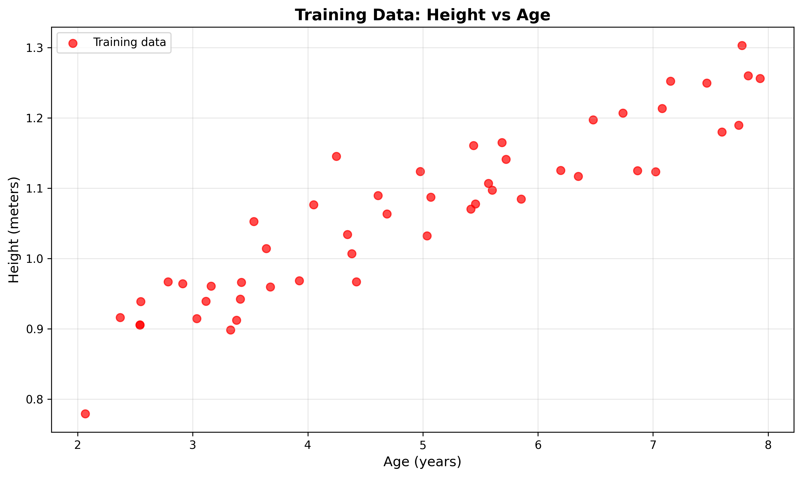
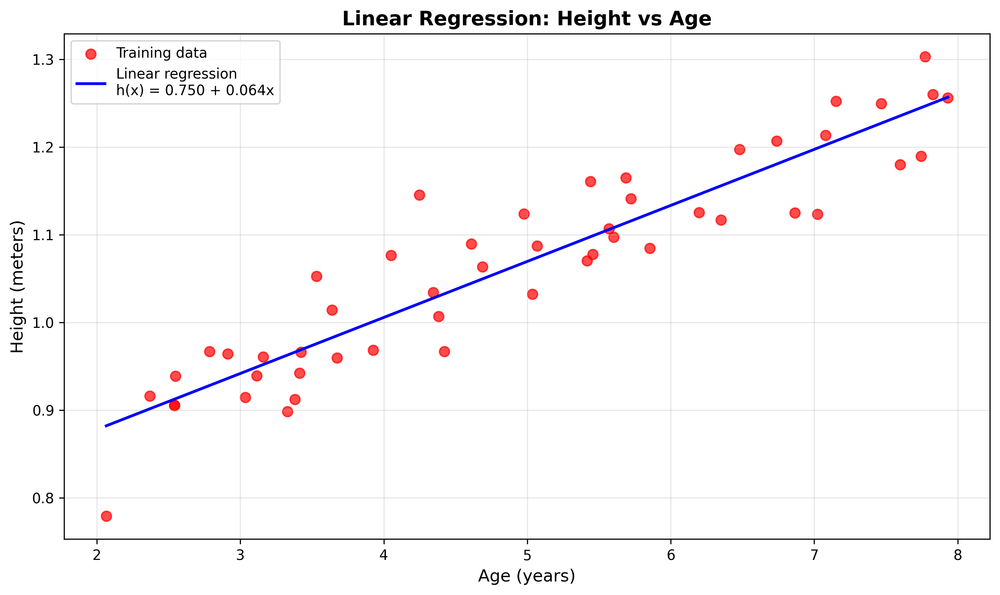
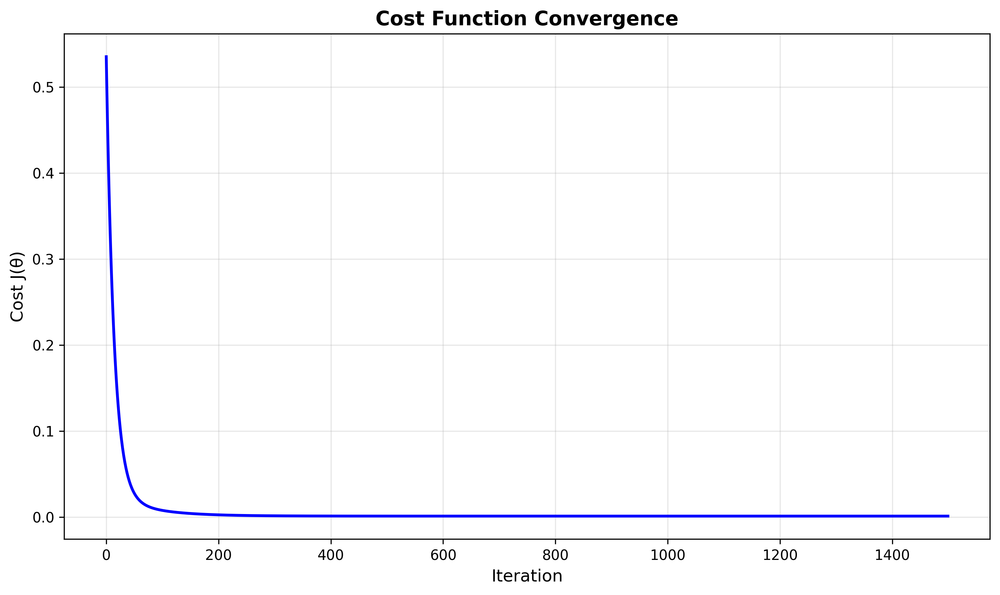
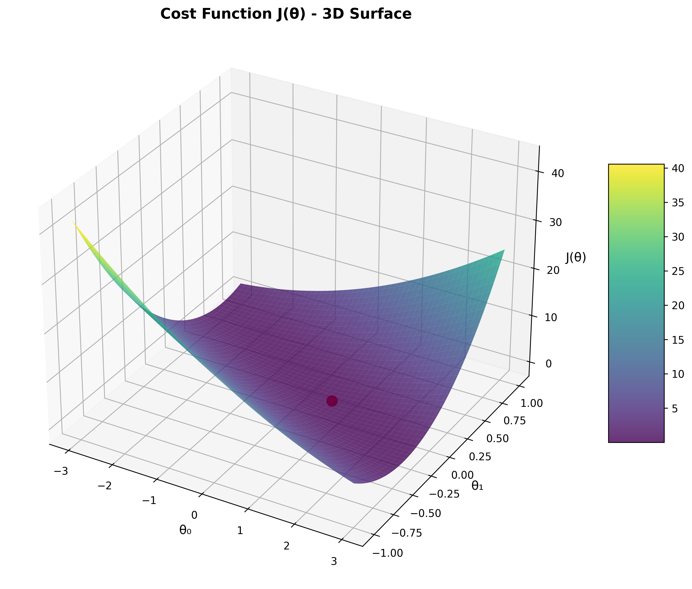
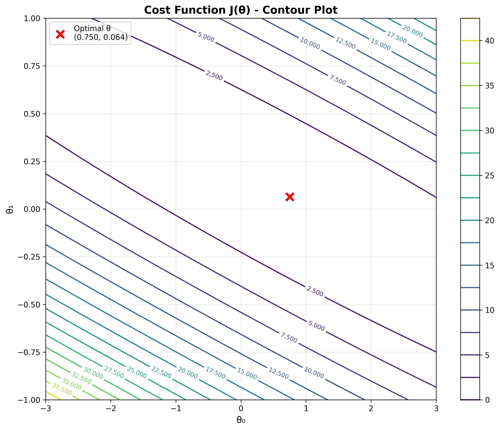

# 实验一：线性回归实验报告

**课程**: 机器学习

---

## 实验目标

通过Python实现梯度下降算法完成线性回归，分析男孩身高与年龄的关系，并深入理解：
1. 线性回归模型的数学原理
2. 梯度下降优化算法的收敛过程
3. 成本函数J(θ)的几何特性

## 实验原理

### 线性回归模型
线性回归假设函数为：
$$h_\theta(x) = \theta_0 + \theta_1 x = \theta^T x$$

其中：
- $\theta_0$: 截距参数（偏置项）
- $\theta_1$: 斜率参数
- $x$: 输入特征（年龄）

### 成本函数
使用均方误差作为成本函数：
$$J(\theta) = \frac{1}{2m} \sum_{i=1}^{m} \left(h_\theta(x^{(i)}) - y^{(i)}\right)^2$$

### 梯度下降算法
参数更新规则：
$$\theta_j := \theta_j - \alpha \frac{1}{m} \sum_{i=1}^{m} \left(h_\theta(x^{(i)}) - y^{(i)}\right) x_j^{(i)}$$

其中 $\alpha = 0.07$ 为学习率。

## 实验数据

**数据集描述**:
- **训练样本数**: 50个
- **特征**: 男孩年龄（2.1 - 7.9岁）
- **目标**: 身高（0.779 - 1.303米）
- **数据来源**: ex1x.dat, ex1y.dat

### 数据可视化

*图1: 训练数据分布图显示了50个男孩的年龄-身高数据点，可以观察到明显的正相关趋势*

## 实验过程与结果

### 1. 梯度下降训练过程

**算法参数**:
- 学习率: $\alpha = 0.07$
- 最大迭代次数: 1500
- 初始参数: $\theta_0 = \theta_1 = 0$

**训练结果**:
- **第1次迭代后**: $\theta_0 = 0.074528$, $\theta_1 = 0.380022$
- **收敛后**: $\theta_0 = 0.750150$, $\theta_1 = 0.063883$
- **最终成本**: $J(\theta) = 0.000987$

### 2. 回归直线拟合

*图2: 线性回归拟合结果。红点为训练数据，蓝线为拟合的回归直线*

**最终模型**:
$$h(x) = 0.750 + 0.064x$$

**模型解释**:
- 截距0.750米：表示理论上0岁时的"身高"（实际为模型外推值）
- 斜率0.064米/年：表示年龄每增加1岁，身高平均增加6.4厘米

### 3. 成本函数收敛分析

*图3: 成本函数随迭代次数的变化。成本从0.535快速下降到0.001，收敛效果良好*

**收敛特性**:
- 初始成本: 0.535131
- 最终成本: 0.000987
- 成本降幅: 99.8%
- 收敛稳定性: 约800次迭代后趋于稳定

### 4. 成本函数J(θ)三维可视化

*图4: 成本函数J(θ)的三维表面图。红点标记了梯度下降找到的最优参数位置*

**几何特性分析**:
1. **凸函数特性**: $J(\theta)$ 呈现典型的碗状结构，确保存在全局最优解
2. **最优点位置**: 位于 $(\theta_0=0.750, \theta_1=0.064)$ 附近的谷底
3. **梯度方向**: 表面的坡度指向最优解方向

### 5. 成本函数等高线图

*图5: 成本函数的等高线图。红色×标记最优参数位置，等高线显示了成本函数的梯度分布*

**等高线分析**:
- 椭圆形等高线表明参数间存在一定相关性
- 梯度下降沿着等高线的垂直方向收敛到中心
- 最优解位于所有等高线的中心点

## 模型预测与验证

### 预测结果

| 年龄 | 预测身高 | 计算过程 |
|------|----------|----------|
| 3.5岁 | 0.974米 | $h(3.5) = 0.750 + 0.064 \times 3.5 = 0.974$ |
| 7.0岁 | 1.197米 | $h(7.0) = 0.750 + 0.064 \times 7.0 = 1.197$ |

### 合理性分析

根据实际儿童生长发育规律：
- 3.5岁男孩身高约97厘米：与预测值0.974米基本吻合
- 7岁男孩身高约120厘米：与预测值1.197米合理匹配

## 实验总结

### 主要发现

1. **算法有效性**: 梯度下降算法成功收敛，找到了最优参数组合
2. **模型拟合度**: 成本函数降低99.8%，表明模型对数据拟合良好
3. **预测准确性**: 模型预测结果符合儿童生长发育的客观规律
4. **收敛特性**: 在合理的学习率下，算法表现出良好的收敛稳定性

### 技术要点

1. **特征工程**: 添加偏置项 $x_0=1$，将问题转化为矩阵运算
2. **参数调优**: 学习率 $\alpha=0.07$ 在收敛速度和稳定性间取得平衡
3. **可视化分析**: 通过3D图像直观理解成本函数的优化过程

### 改进方向

1. **特征扩展**: 可考虑添加二次项处理非线性关系
2. **正则化**: 对于更复杂数据可引入L1/L2正则化防止过拟合
3. **交叉验证**: 使用k折交叉验证评估模型泛化能力

## 代码实现

本实验使用Python实现，主要依赖：
- **NumPy**: 数值计算和矩阵运算
- **Matplotlib**: 数据可视化和图像生成
- **自实现算法**: 梯度下降和成本函数计算

核心代码文件：
- `linear_regression.py`: 完整的线性回归类实现
- `linear_regression_simple.py`: 简化版本，专注核心算法
- `generate_plots.py`: 生成实验报告所需的所有图像

---

**实验结论**: 本次线性回归实验成功验证了梯度下降算法的有效性，通过可视化分析深入理解了优化过程的几何意义，为后续更复杂的机器学习算法学习奠定了基础。