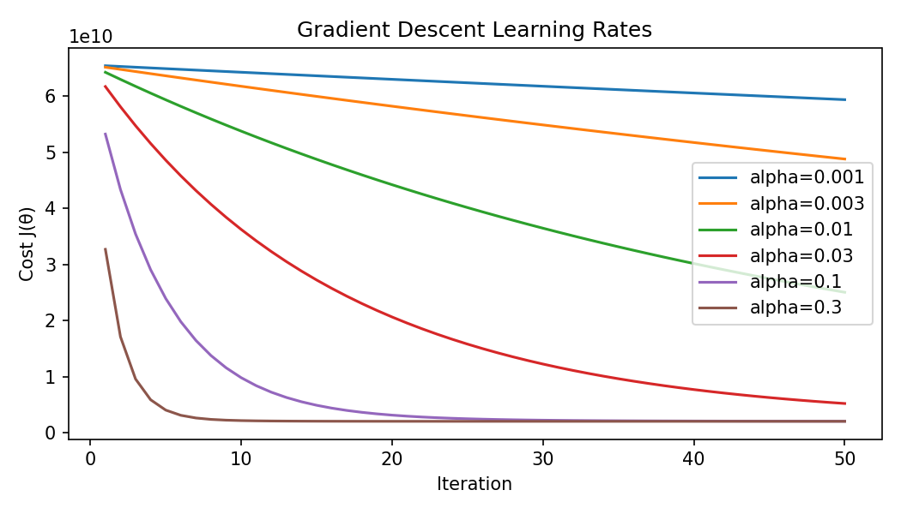
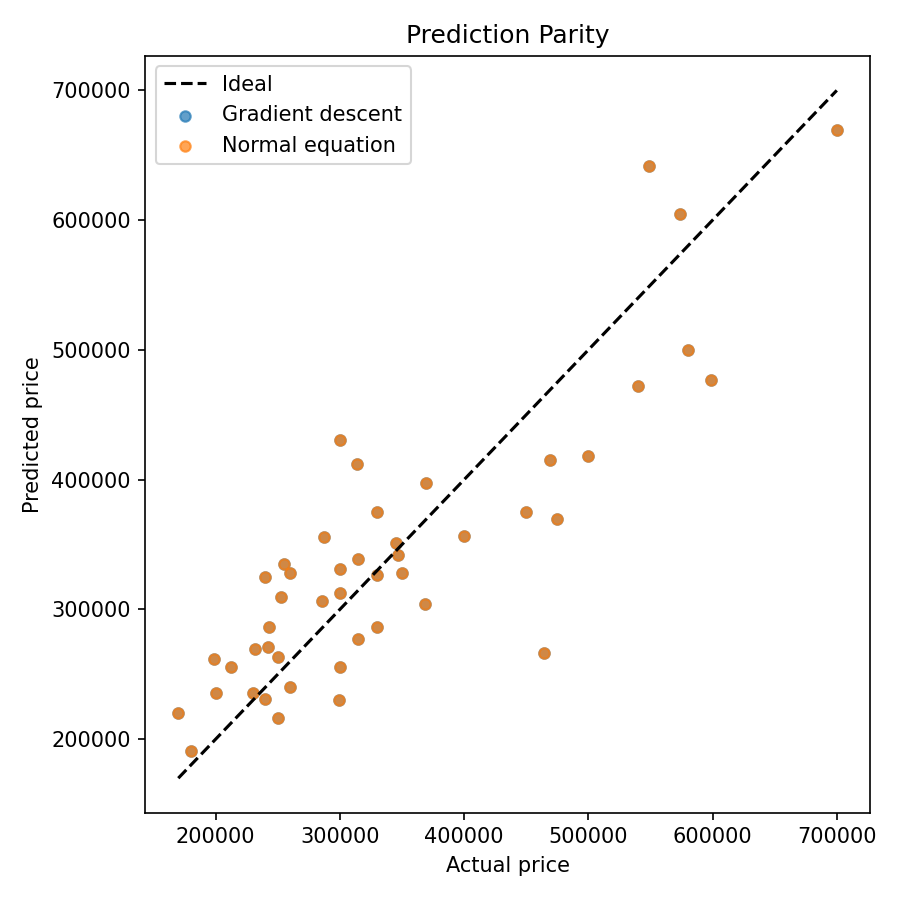

# Experiment 2: Multivariate Linear Regression

## 任务与数据
- 数据集：波特兰房价，样本数 m=47，特征为房屋面积（平方英尺）与卧室数；数据路径 `ex2Data/ex2Data/ex2x.dat` 与 `ex2Data/ex2Data/ex2y.dat`。
- 数据读取与标准化：加载两列特征后，对每列做零均值、单位方差的缩放，并添加偏置项；实现见 `ex2.py:31` 与 `ex2.py:42`。
- 训练策略：批量梯度下降迭代参数、正规方程一次性求解，两者共用添加偏置后的设计矩阵；对应 `ex2.py:63`、`ex2.py:81` 以及主流程 `ex2.py:180`。
- 可视化与存档：学习率扫描、学习曲线图、预测对比图和关键指标均写入 `outputs` 目录，便于复现实验；实现集中在 `ex2.py:100`、`ex2.py:110`、`ex2.py:127` 与 `ex2.py:229`。

## 方法与原理
本节将原理分析与数学推导合并呈现，并与实验目标直接对应，便于从“为什么这样做”到“如何实现”一体化理解。
- 模型与假设：对每个样本 $$x ∈ R^{n+1}$$(含截距 $$x_0=1$$)，预测 $$h_θ(x) = θ^T x$$。
- 目标函数（均方误差）：
  - 标量形式：$$J(θ) = \frac{1}{2m} \sum_i \big(h_θ(x^{(i)}) - y^{(i)}\big)^2$$
  - 向量化：令 $$X ∈ R^{m×(n+1)}$$、$$y ∈ R^{m}$$，则 $$J(θ) = \tfrac{1}{2m} \|Xθ - y\|_2^2$$
- 一阶导数（梯度）：$$∇J(θ) = \tfrac{1}{m} X^T (Xθ - y)$$。推导：$$\partial(\tfrac{1}{2} \|r\|^2)/\partial θ = (\partial r/\partial θ)^T r = X^T (Xθ - y)$$，再除以 $$m$$。
- 批量梯度下降更新：$$θ := θ - α ∇J(θ)$$，其中 $$α$$ 为学习率。若 $$0 < α < 2/L$$（$$L$$ 为 $$(1/m) X^T X$$ 最大特征值）则单调收敛。
- 正规方程（闭式解）：令梯度为 0 得 $$X^T (Xθ - y) = 0$$ → $$(X^T X)θ = X^T y$$ → $$θ^* = (X^T X)^{-1} X^T y$$。为稳健起见，用伪逆 `pinv` 处理奇异或病态的 $$X^T X$$。
- 特征标准化与参数还原：对非截距列做 $$x' = (x - μ)/σ$$，则在标准化空间训练到的 $$θ'$$ 与原尺度参数 $$θ$$ 的关系为
  - $$θ_j = θ'_j / σ_j$$（$$j ≥ 1$$）
  - $$θ_0 = θ'_0 - \sum_j (μ_j/σ_j) θ'_j$$
  对应实现见 `ex2.py:173`。

## 实现与代码
1. **学习率扫描**：测试 `[0.001, 0.003, 0.01, 0.03, 0.1, 0.3]` 六个学习率，各迭代 50 次并输出代价值曲线。列表设置与批量运行见 `ex2.py:186` 与 `ex2.py:187`；CSV 与折线图由 `ex2.py:100` 与 `ex2.py:110` 生成。
2. **收敛训练**：选择 50 次迭代后代价最低的 `α=0.3`，再迭代 400 次得到最终参数；逻辑位于 `ex2.py:194` 至 `ex2.py:210`。
3. **参数对齐**：梯度下降在标准化空间求得的 θ 经 `rescale_theta` 还原到原始尺度，直接和正规方程结果对比；函数见 `ex2.py:173`。
4. **误差评估**：对整套训练样本计算 RMSE，并绘制真实值与预测值一致性的散点图；实现见 `ex2.py:216` 与 `ex2.py:226` 以及 `ex2.py:127`。

## 可视化分析
- **学习率影响**：`outputs/learning_curves.png` 展示不同 α 下 50 次迭代内的代价变化。较小 α（0.001、0.003）收敛缓慢；α=0.3 曲线最快衰减且保持稳定，验证标准化后的学习率上限。

  

- **预测一致性**：`outputs/prediction_parity.png` 将真实价格与两种方法的预测绘制在 $$y=x$$ 参考线附近，两组点几乎完全重合，说明梯度下降已收敛至解析解。

  

## 实验结果
- 数据量：47 套房源。
- 学习率扫描（50 次迭代）：

  | α | 最终 $$J(θ)$$ |
  | --- | --- |
  | 0.001 | 5.94×10¹⁰ |
  | 0.003 | 4.88×10¹⁰ |
  | 0.01 | 2.51×10¹⁰ |
  | 0.03 | 5.22×10⁹ |
  | 0.10 | 2.06×10⁹ |
  | 0.30 | **2.04×10⁹** |

- 梯度下降（α=0.3，400 次迭代）：
  - θ（标准化空间）≈ `[3.40e5, 1.09e5, -6.58e3]`
  - θ（还原后）≈ `[8.96e4, 1.39e2, -8.74e3]`
  - RMSE ≈ 6.39×10⁴，美金预测（1650 平方英尺，3 卧室）≈ **293,081**

- 正规方程：
  - θ ≈ `[8.96e4, 1.39e2, -8.74e3]`
  - RMSE ≈ 6.39×10⁴，预测同为 **293,081**

  还原后的梯度下降参数与正规方程仅差 1e-6 量级，证明迭代训练与闭式解一致。

## 实现片段
- 数据加载与标准化：`ex2.py:31`、`ex2.py:42`
  ```python
  X = np.loadtxt(x_path); y = np.loadtxt(y_path)
  means = X.mean(axis=0); stds = X.std(axis=0); X_norm = (X - means) / stds
  X_gd = np.column_stack([np.ones(m), X_norm])
  ```
- 代价与梯度：`ex2.py:58`、`ex2.py:63`
  ```python
  def compute_cost(X, y, theta):
      diff = X @ theta - y
      return (diff @ diff) / (2.0 * len(y))
  
  def gradient_descent(X, y, alpha, iterations, initial_theta=None):
      theta = np.zeros(X.shape[1]) if initial_theta is None else initial_theta.copy()
      for i in range(iterations):
          error = X @ theta - y
          gradient = (X.T @ error) / len(y)
          theta -= alpha * gradient
  ```
- 正规方程：`ex2.py:81`
  ```python
  theta_ne = np.linalg.pinv(X.T @ X) @ X.T @ y
  ```
- 参数还原与评估：`ex2.py:173`、`ex2.py:216`
  ```python
  theta_unscaled[1:] = theta_scaled[1:] / stds
  theta_unscaled[0] = theta_scaled[0] - np.sum((means / stds) * theta_scaled[1:])
  rmse = np.sqrt(np.mean((X @ theta - y)**2))
  ```
