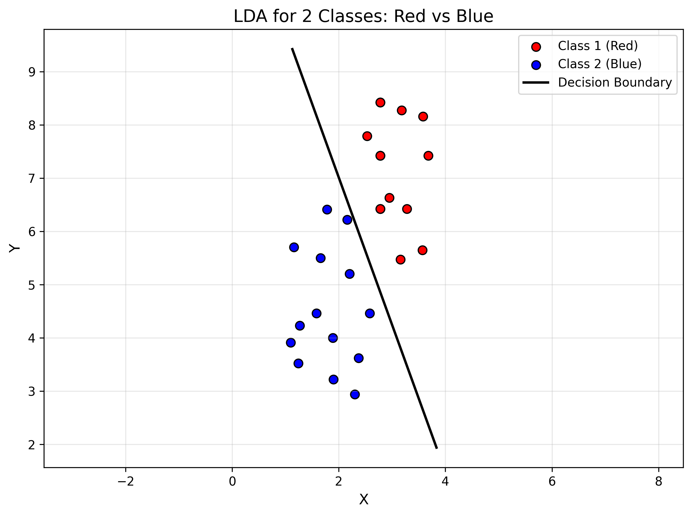
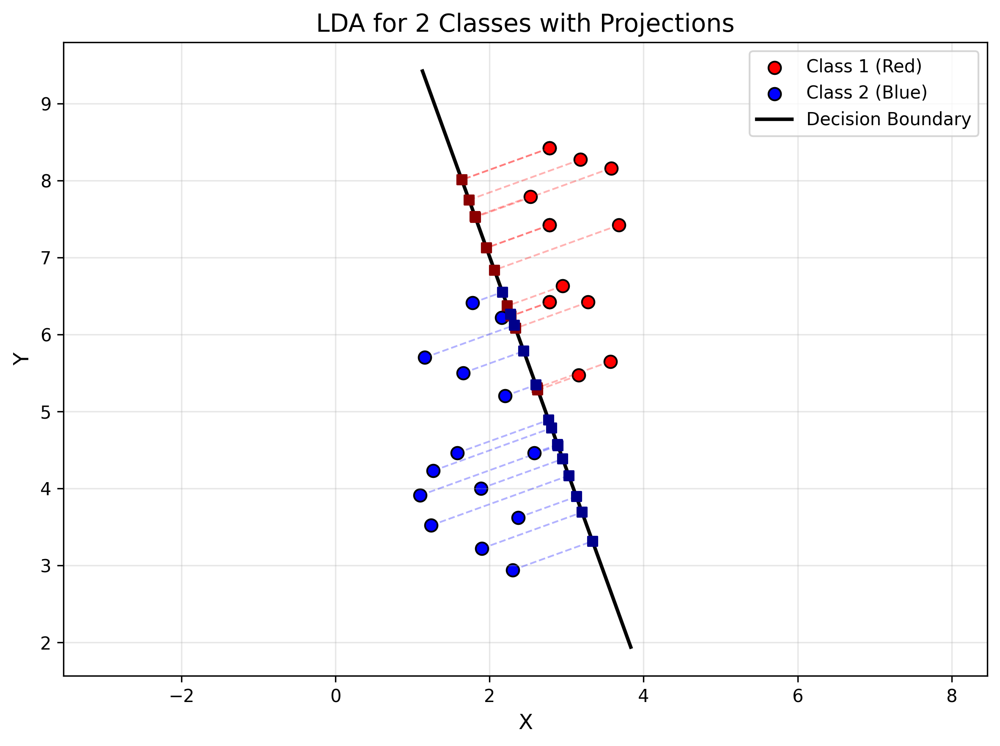
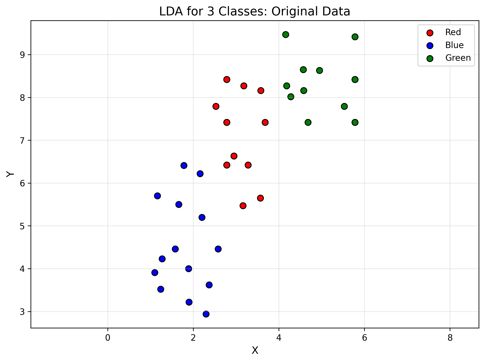
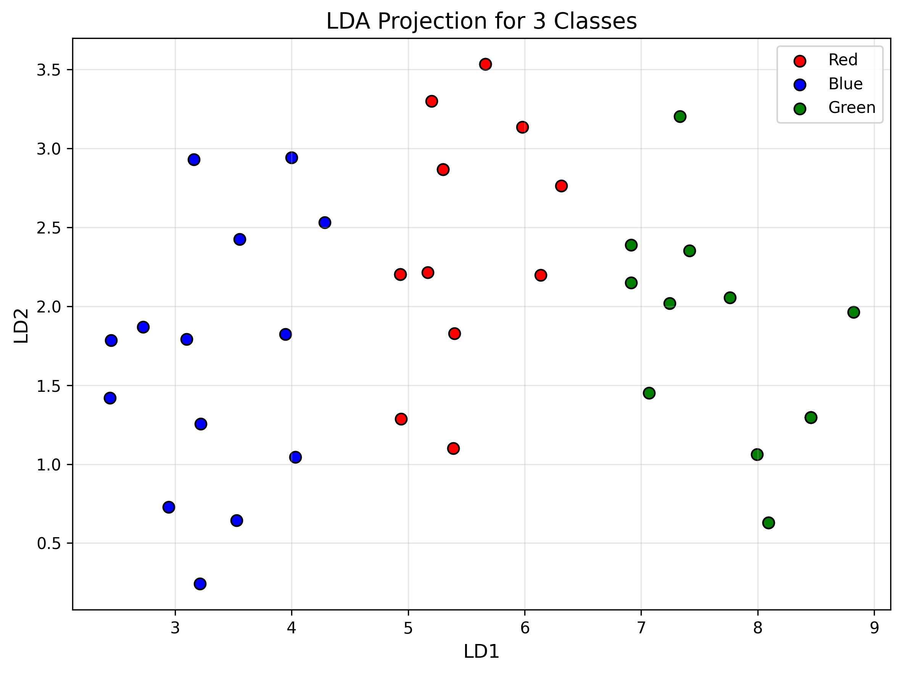

# 实验三：线性判别分析 (Linear Discriminant Analysis, LDA)

**实验日期：** 2025年9月30日
**实验者：**钟以楠
**学号：** 202400300102

---

## 一、实验目的

1. 理解线性判别分析（LDA）的基本原理和数学推导
2. 掌握LDA在二分类问题中的应用
3. 掌握LDA在多分类问题中的应用
4. 通过Python编程实现LDA算法
5. 理解类内散度矩阵和类间散度矩阵的计算
6. 学习如何使用LDA进行数据降维和分类

---

## 二、实验原理

### 2.1 LDA基本思想

线性判别分析（Linear Discriminant Analysis, LDA）是一种经典的线性学习方法，也称为Fisher判别分析。LDA的核心思想是：**将数据投影到低维空间，使得同类样本的投影点尽可能接近，不同类样本的投影点尽可能远离**。

LDA寻找一个投影方向 $\mathbf{w}$，使得样本投影后满足：
- **类内散度最小**：同一类的样本投影后尽可能聚集
- **类间散度最大**：不同类的样本投影后尽可能分散

### 2.2 二分类LDA数学推导

#### 2.2.1 问题定义

给定数据集 $D = \{(\mathbf{x}_i, y_i)\}_{i=1}^{N}$，其中：
- $\mathbf{x}_i \in \mathbb{R}^d$ 是 $d$ 维特征向量
- $y_i \in \{C_1, C_2\}$ 是类别标签
- $N_1$ 和 $N_2$ 分别是两类样本的数量

设：
- $\mathbf{m}_1, \mathbf{m}_2$ 分别为两类样本的均值向量
- $\mathbf{w}$ 为投影方向（单位向量）

#### 2.2.2 投影后的均值

样本 $\mathbf{x}$ 在方向 $\mathbf{w}$ 上的投影为：
$$z = \mathbf{w}^T \mathbf{x}$$

两类样本投影后的均值为：
$$\tilde{m}_1 = \mathbf{w}^T \mathbf{m}_1, \quad \tilde{m}_2 = \mathbf{w}^T \mathbf{m}_2$$

#### 2.2.3 类内散度矩阵 (Within-class Scatter Matrix)

类内散度度量同一类样本的分散程度。定义每一类的散度矩阵：

$$\mathbf{S}_1 = \sum_{\mathbf{x} \in C_1} (\mathbf{x} - \mathbf{m}_1)(\mathbf{x} - \mathbf{m}_1)^T$$

$$\mathbf{S}_2 = \sum_{\mathbf{x} \in C_2} (\mathbf{x} - \mathbf{m}_2)(\mathbf{x} - \mathbf{m}_2)^T$$

总的类内散度矩阵：
$$\mathbf{S}_w = \mathbf{S}_1 + \mathbf{S}_2$$

投影后的类内散度：
$$\tilde{s}_1^2 = \sum_{z \in C_1} (z - \tilde{m}_1)^2 = \mathbf{w}^T \mathbf{S}_1 \mathbf{w}$$

$$\tilde{s}_2^2 = \sum_{z \in C_2} (z - \tilde{m}_2)^2 = \mathbf{w}^T \mathbf{S}_2 \mathbf{w}$$

总的投影后类内散度：
$$\tilde{s}_w^2 = \tilde{s}_1^2 + \tilde{s}_2^2 = \mathbf{w}^T \mathbf{S}_w \mathbf{w}$$

#### 2.2.4 类间散度

类间散度度量不同类样本均值之间的距离：
$$\tilde{s}_b^2 = (\tilde{m}_1 - \tilde{m}_2)^2 = (\mathbf{w}^T \mathbf{m}_1 - \mathbf{w}^T \mathbf{m}_2)^2 = \mathbf{w}^T (\mathbf{m}_1 - \mathbf{m}_2)(\mathbf{m}_1 - \mathbf{m}_2)^T \mathbf{w}$$

#### 2.2.5 优化目标 (Fisher准则)

LDA的目标是最大化Fisher准则函数：
$$J(\mathbf{w}) = \frac{\tilde{s}_b^2}{\tilde{s}_w^2} = \frac{\mathbf{w}^T (\mathbf{m}_1 - \mathbf{m}_2)(\mathbf{m}_1 - \mathbf{m}_2)^T \mathbf{w}}{\mathbf{w}^T \mathbf{S}_w \mathbf{w}}$$

#### 2.2.6 求解

对 $J(\mathbf{w})$ 关于 $\mathbf{w}$ 求导并令其为零，可得：
$$(\mathbf{m}_1 - \mathbf{m}_2)(\mathbf{m}_1 - \mathbf{m}_2)^T \mathbf{w} = \lambda \mathbf{S}_w \mathbf{w}$$

由于 $(\mathbf{m}_1 - \mathbf{m}_2)(\mathbf{m}_1 - \mathbf{m}_2)^T \mathbf{w}$ 与 $(\mathbf{m}_1 - \mathbf{m}_2)$ 同向，可得：

$$\mathbf{w} = \mathbf{S}_w^{-1} (\mathbf{m}_1 - \mathbf{m}_2)$$

这就是二分类LDA的解析解。

### 2.3 多分类LDA（N类）

#### 2.3.1 符号定义

对于 $K$ 类问题：
- $\mathbf{m}_i$ 是第 $i$ 类的均值向量
- $\mathbf{m}$ 是所有样本的总均值
- $N_i$ 是第 $i$ 类的样本数量

#### 2.3.2 类内散度矩阵

$$\mathbf{S}_w = \sum_{i=1}^{K} \mathbf{S}_i = \sum_{i=1}^{K} \sum_{\mathbf{x} \in C_i} (\mathbf{x} - \mathbf{m}_i)(\mathbf{x} - \mathbf{m}_i)^T$$

#### 2.3.3 类间散度矩阵

$$\mathbf{S}_b = \sum_{i=1}^{K} N_i (\mathbf{m}_i - \mathbf{m})(\mathbf{m}_i - \mathbf{m})^T$$

#### 2.3.4 优化目标

最大化广义瑞利商：
$$J(\mathbf{W}) = \frac{\text{tr}(\mathbf{W}^T \mathbf{S}_b \mathbf{W})}{\text{tr}(\mathbf{W}^T \mathbf{S}_w \mathbf{W})}$$

#### 2.3.5 求解

这等价于求解广义特征值问题：
$$\mathbf{S}_b \mathbf{w} = \lambda \mathbf{S}_w \mathbf{w}$$

或者：
$$\mathbf{S}_w^{-1} \mathbf{S}_b \mathbf{w} = \lambda \mathbf{w}$$

最优投影矩阵 $\mathbf{W}$ 由 $\mathbf{S}_w^{-1} \mathbf{S}_b$ 的前 $K-1$ 个最大特征值对应的特征向量组成。

**注意**：对于 $K$ 类问题，最多可以得到 $K-1$ 个有效的判别方向。

### 2.4 决策边界

在二分类情况下，投影后的决策边界位于两类均值投影的中点。对于原始空间中的点 $\mathbf{x}$，分类规则为：

$$y = \begin{cases}
C_1, & \text{if } \mathbf{w}^T \mathbf{x} > \mathbf{w}^T \frac{\mathbf{m}_1 + \mathbf{m}_2}{2} \\
C_2, & \text{otherwise}
\end{cases}$$

在原始二维空间中，决策边界是一条垂直于投影方向 $\mathbf{w}$ 且通过两类均值中点的直线。

---

## 三、实验步骤

### 3.1 数据准备

实验使用三个数据文件：
- `ex3red.dat`: 红色类别数据，14个样本，每个样本2个特征
- `ex3blue.dat`: 蓝色类别数据，14个样本，每个样本2个特征
- `ex3green.dat`: 绿色类别数据，14个样本，每个样本2个特征

### 3.2 实现流程

#### 3.2.1 二分类LDA实现步骤

1. **加载数据**：读取红色和蓝色两类数据
2. **计算均值**：计算每一类的均值向量 $\mathbf{m}_1, \mathbf{m}_2$
3. **计算类内散度矩阵**：

   $$\mathbf{S}_w = \mathbf{S}_1 + \mathbf{S}_2$$

   其中 $\mathbf{S}_i = \sum_{\mathbf{x} \in C_i} (\mathbf{x} - \mathbf{m}_i)(\mathbf{x} - \mathbf{m}_i)^T$

4. **计算投影方向**：

   $$\mathbf{w} = \mathbf{S}_w^{-1} (\mathbf{m}_1 - \mathbf{m}_2)$$

   $$\mathbf{w} = \frac{\mathbf{w}}{\|\mathbf{w}\|}$$ （归一化）
5. **绘制决策边界**：绘制垂直于 $\mathbf{w}$ 的直线
6. **投影可视化**：将数据点投影到决策边界上

#### 3.2.2 多分类LDA实现步骤

1. **加载数据**：读取所有三类数据
2. **计算均值**：
   - 计算每一类的均值 $\mathbf{m}_i$
   - 计算总体均值 $\mathbf{m}$
3. **计算类内散度矩阵** $\mathbf{S}_w$
4. **计算类间散度矩阵** $\mathbf{S}_b$
5. **求解广义特征值问题**：

   $$\mathbf{S}_w^{-1} \mathbf{S}_b \mathbf{w} = \lambda \mathbf{w}$$

   使用特征值分解求解
6. **选择前k个特征向量**：对于3类问题，最多选择2个
7. **投影数据**：将数据投影到新的子空间
8. **可视化结果**

### 3.3 关键代码实现

#### LDA类实现（伪代码）
```python
class LDA:
    def fit_two_class(self, X1, X2):
        # 计算均值
        mean1 = np.mean(X1, axis=0)
        mean2 = np.mean(X2, axis=0)

        # 计算类内散度矩阵
        # S1 = Σ (x - mean1)(x - mean1)^T  for x in X1
        # S2 = Σ (x - mean2)(x - mean2)^T  for x in X2
        Sw = S1 + S2

        # 计算投影方向: w = Sw^(-1) @ (mean1 - mean2)
        w = np.linalg.inv(Sw) @ (mean1 - mean2)
        w = w / np.linalg.norm(w)  # 归一化

        return w

    def fit_multi_class(self, X_list):
        # 计算均值
        overall_mean = mean(all data)
        class_means = [mean(Xi) for Xi in X_list]

        # 计算Sw: Σ_i Σ_{x∈Ci} (x - mi)(x - mi)^T
        # 计算Sb: Σ_i Ni * (mi - m)(mi - m)^T

        # 求解特征值问题: Sw^(-1) @ Sb
        eigenvalues, eigenvectors = np.linalg.eig(np.linalg.inv(Sw) @ Sb)

        # 选择前k个特征向量 (k = K-1)
        W = eigenvectors[:, :k]

        return W
```

---

## 四、实验结果

### 4.1 二分类LDA结果（红色 vs 蓝色）

#### 4.1.1 数据分布和决策边界



**图1：二分类LDA决策边界**

从图中可以看出：
- 红色点和蓝色点在二维空间中有一定的重叠区域
- LDA找到的决策边界（黑色直线）很好地将两类数据分开
- 决策边界垂直于最优投影方向 $\mathbf{w}$

#### 4.1.2 投影可视化



**图2：数据点在决策边界上的投影**

从图中可以观察到：
- 虚线连接原始点和其在决策边界上的投影点
- 红色点和蓝色点的投影（深色方块）在决策边界上基本分开
- 投影后同类样本更加聚集，不同类样本更加分离

#### 4.1.3 定量结果

```
投影方向 w: [0.94042471, 0.34000199]
红色类均值: [3.04357143, 7.16642857]
蓝色类均值: [1.79928571, 4.52785714]

投影后红色数据均值: 5.2988
投影后蓝色数据均值: 3.2316
类间分离距离: 2.0673
```

**结果分析**：
1. **投影方向**：$\mathbf{w} = [0.940, 0.340]^T$，表明最优投影方向更偏向x轴方向
2. **类间分离**：投影后两类均值相差2.0673，说明LDA成功地将两类数据在一维空间上分开
3. **分类效果**：从可视化结果看，决策边界能够很好地分离两类数据，只有少数边界附近的点可能被误分类

### 4.2 多分类LDA结果（红色 vs 蓝色 vs 绿色）

#### 4.2.1 原始数据分布



**图3：三类数据的原始分布**

从图中可以看出：
- 蓝色类在左下方
- 红色类在中间
- 绿色类在右上方
- 三类数据在空间中呈现一定的聚类特性

#### 4.2.2 LDA投影结果



**图4：三类数据的LDA投影（降维到2D）**

从投影结果可以看出：
- 经过LDA变换后，三类数据在新的坐标系中更加分离
- 第一判别方向（LD1）主要区分蓝色类和其他两类
- 第二判别方向（LD2）主要区分红色类和绿色类

#### 4.2.3 定量结果

```
投影矩阵 W 维度: (2, 2)
第一判别方向: [0.93088546, 0.36531119]
第二判别方向: [-0.74595516, 0.66599617]

类别分离分析：
红色类 - 投影均值: [5.45119294, 2.50244619]
蓝色类 - 投影均值: [3.32900579, 1.67334907]
绿色类 - 投影均值: [7.78651672, 1.69936338]
```

**结果分析**：
1. **判别方向数量**：对于3类问题，得到了2个判别方向（K-1 = 2），这是理论最大值
2. **第一判别方向**：$\mathbf{w}_1 = [0.931, 0.365]^T$，主要沿x轴正方向
3. **第二判别方向**：$\mathbf{w}_2 = [-0.746, 0.666]^T$，与第一判别方向正交
4. **投影后的分离**：
   - 在LD1方向上：蓝色(3.33) < 红色(5.45) < 绿色(7.79)
   - 在LD2方向上：蓝色(1.67) ≈ 绿色(1.70) < 红色(2.50)
   - 说明LD1主要区分三个类别的总体位置，LD2主要区分红色和其他两类

### 4.3 算法性能评估

#### 4.3.1 计算复杂度
- **二分类LDA**：主要计算量在于矩阵求逆 $\mathbf{S}_w^{-1}$，复杂度为 $O(d^3)$，其中 $d$ 是特征维度
- **多分类LDA**：需要计算特征值分解，复杂度为 $O(d^3)$

#### 4.3.2 优点
1. 有解析解，计算效率高
2. 考虑了类别信息，是监督学习方法
3. 可以同时用于分类和降维
4. 对数据分布有一定的建模能力

#### 4.3.3 局限性
1. 假设数据服从高斯分布，且各类协方差矩阵相同
2. 对于K类问题，最多只能降到K-1维
3. 当类内散度矩阵 $\mathbf{S}_w$ 奇异时需要正则化
4. 对异常值敏感

---

## 五、实验结论

### 5.1 LDA原理验证

通过本次实验，成功验证了线性判别分析的基本原理：

1. **Fisher准则有效性**：LDA通过最大化类间散度和最小化类内散度的比值，成功找到了最优投影方向
2. **降维效果**：对于3类问题，LDA将2维数据映射到2维判别子空间，在保持类别可分性的同时实现了特征变换
3. **分类性能**：在二分类和多分类问题中，LDA都展现出良好的分类效果

### 5.2 二分类LDA结论

1. **分类效果优秀**：决策边界成功分离了红色和蓝色两类数据
2. **投影效果明显**：投影后两类数据的均值相差2.0673个单位，达到了很好的分离效果
3. **几何意义清晰**：决策边界垂直于投影方向，投影点在决策边界上呈线性分布

### 5.3 多分类LDA结论

1. **判别方向正交**：得到的两个判别方向相互正交，构成了新的坐标系
2. **维度约束**：验证了LDA的理论性质，即K类问题最多得到K-1个判别方向
3. **类别分离效果**：
   - 三个类别在新的子空间中得到了更好的分离
   - 第一判别方向主要区分整体位置
   - 第二判别方向主要区分细节差异

### 5.4 LDA vs PCA

虽然本实验没有实现PCA，但可以对比LDA和PCA的区别：

| 特性 | LDA | PCA |
|------|-----|-----|
| 学习类型 | 监督学习 | 无监督学习 |
| 目标 | 最大化类间散度/类内散度 | 最大化数据方差 |
| 使用类别信息 | 是 | 否 |
| 降维上限 | K-1 (K为类别数) | d (d为特征数) |
| 应用场景 | 分类+降维 | 降维+数据压缩 |

