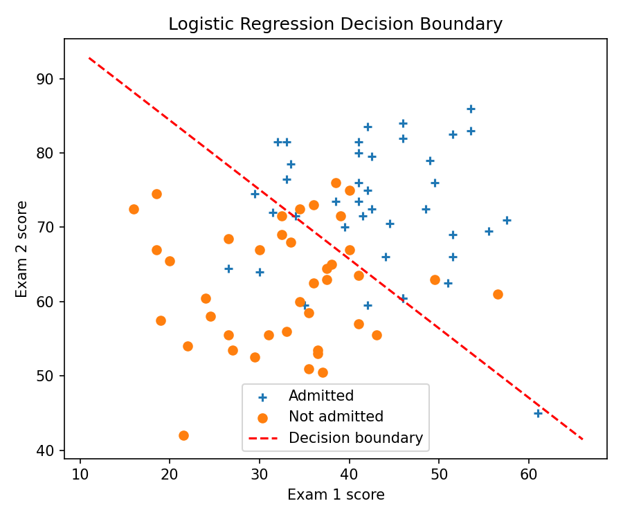
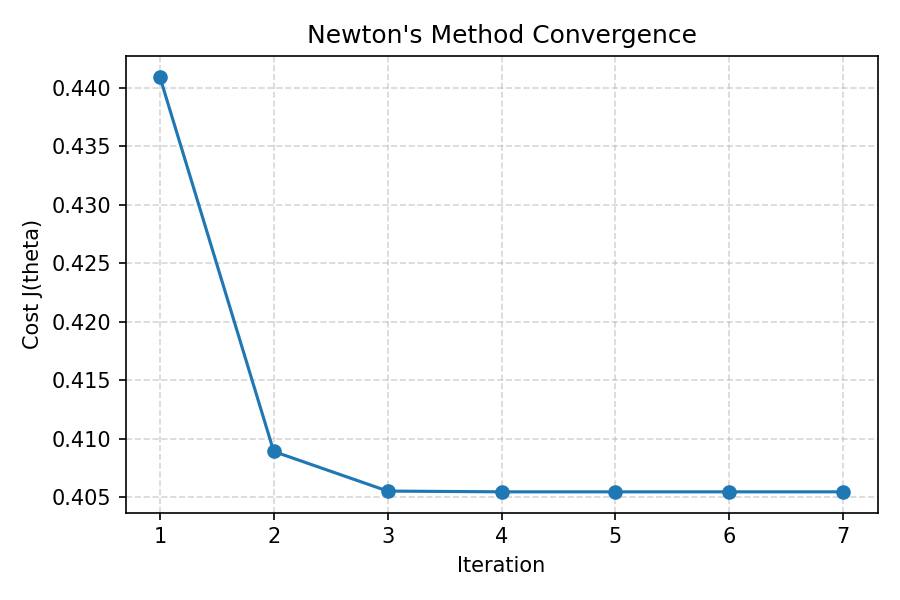

# 实验报告

- 姓名：钟以楠
- 学号：202400300102

## 实验目标与数据概览

- 利用两门标准化考试成绩预测 80 名学生的大学录取情况（40 录取、40 未录取）。
- 在设计矩阵中添加截距项 $$x_0=1$$，并用不同标记可视化正、负样本分布，从而直观理解分类边界。
- 基于逻辑回归模型构建概率分类器，并采用牛顿法求解最优参数，使训练误差收敛。

## 逻辑回归模型原理
- 模型假设：给定特征向量 $$x \in \mathbb{R}^{n+1}$$（已包含截距列），预测函数为
  $$h_\theta (x)=\sigma(\theta^\top x)=\frac{1}{1+\exp(-\theta^\top x)} = P(y=1\mid x;\theta).$$
- 对数似然最大化等价于交叉熵损失最小化，经验风险为
  $$J(\theta)=-\frac{1}{m}\sum_{i=1}^{m} \left[ y^{(i)} \log h_\theta(x^{(i)}) + \bigl(1-y^{(i)}\bigr)\log \bigl(1-h_\theta(x^{(i)})\bigr) \right].$$
- 对 $$J(\theta)$$ 求梯度：先对单样本损失求偏导，再按链式法则汇总为矩阵形式
  $$\nabla_\theta J(\theta) = \frac{1}{m}\sum_{i=1}^m \bigl(h_\theta(x^{(i)}) - y^{(i)}\bigr)x^{(i)} = \frac{1}{m} X^\top \bigl(h_\theta(X) - y\bigr),$$
  其中 $$X \in \mathbb{R}^{m \times (n+1)}$$、$$h_\theta(X) = [h_\theta(x^{(1)}),\ldots, h_\theta(x^{(m)})]^\top$$。
- 进一步求 Hessian，可将第二阶导写成对角矩阵 $$R$$ 的形式：
  $$\nabla_\theta^2 J(\theta) = \frac{1}{m} X^\top R X, \quad R = \operatorname{diag}\left(h_\theta(x^{(i)})\bigl(1-h_\theta(x^{(i)})\bigr)\right)_{i=1}^{m}.$$
  $$R$$ 反映了 Sigmoid 函数的局部曲率，确保 Hessian 为半正定矩阵，使牛顿法在凸优化问题中快速收敛。

## 牛顿法优化流程
- 迭代初始化：$$\theta^{(0)} = \mathbf{0}$$。
- 每轮更新包含一次线性化求解：
  $$\theta^{(t+1)} = \theta^{(t)} - \left[\nabla_\theta^2 J\bigl(\theta^{(t)}\bigr)\right]^{-1} \nabla_\theta J\bigl(\theta^{(t)}\bigr).$$
- 终止条件通常为梯度范数低于阈值或损失函数下降幅度小于设定值；实践中 5-15 次迭代即可达到稳定点。
- 决策边界对应
  $$P(y=1\mid x;\theta) = 0.5 \quad \Longleftrightarrow \quad \theta^\top x = 0,$$
  即二维空间中的一条直线，可将求得的 $$\theta$$ 带入绘图。

## Python 实现步骤
1. **加载与预处理**  
   `newton_logistic_regression.py` 中调用 `numpy.loadtxt` 读入 `data/ex4x.dat` 与 `data/ex4y.dat`，随后通过 `np.hstack` 添加截距列构造 $$X \in \mathbb{R}^{m\times 3}$$。
2. **核心函数定义**  
   - `sigmoid(z)` 先对输入裁剪到 [-500,500]，避免 `exp` 溢出。  
   - `compute_cost(theta, X, y)` 采用交叉熵并对 $$h_\theta(x)$$ 再次裁剪到 $$(10^{-12}, 1-10^{-12})$$，确保 $$\log$$ 运算稳定。  
   - `gradient` 与 `hessian` 分别实现
     $$\nabla_\theta J(\theta) = \frac{1}{m}X^\top(h_\theta(X)-y), \quad \nabla_\theta^2 J(\theta) = \frac{1}{m} X^\top R X,$$
     其中 $$R=\operatorname{diag}(h_\theta(x^{(i)})(1-h_\theta(x^{(i)})))$$，并在 Hessian 上叠加阻尼项 $$\lambda I$$（代码中 $$\lambda=10^{-6}$$）增强可逆性。
3. **牛顿法主循环**  
   - 初始参数 $$\theta^{(0)}=\mathbf{0}$$，最大迭代 20 次，梯度范数阈值 $$10^{-7}$$。  
   - 每轮使用 `np.linalg.solve` 求解牛顿增量 $$\Delta\theta = H^{-1}\nabla_\theta J$$，失败时退化为最小二乘求解。  
   - 记录 `cost_history`、`gradient_norms` 以便分析收敛速度。
4. **可视化与评估**  
   - `plot_decision_boundary` 根据 $$\theta_0 + \theta_1 x_1 + \theta_2 x_2 = 0$$ 生成分类直线图，保存为 `decision_boundary.png`。  
   - `plot_cost_history` 绘制损失随迭代变化曲线，保存为 `cost_history.png`。  
   - `threshold_point = [1,20,80]` 用于评估特定学生的录取/未录取概率。

## 实验结果分析
- 收敛情况：算法在 7 次迭代内满足 $$\|\nabla_\theta J(\theta)\|_2 < 10^{-7}$$，最终损失 $$J(\theta^\star) \approx 0.405447.$$  
- 最优参数：  
  $$\theta^\star = \begin{bmatrix}-16.37874341 \\ 0.14834077 \\ 0.15890845 \end{bmatrix},$$  
  表明考试成绩越高，录取概率越大；截距项为负，意味着整体判定偏向“未录取”的先验。  
- 预测：成绩 $$(20, 80)$$ 的学生录取概率 $$P(y=1\mid x) \approx 0.331978$$，未录取概率 $$P(y=0\mid x) \approx 0.668022$$，说明在该模型下更可能被拒。  
- 图像结果：  
  - `decision_boundary.png` 展示正负样本分布及最终分类直线，验证模型将两类有效分隔。  
  - `cost_history.png` 显示损失下降呈近指数收敛，符合牛顿法在凸问题中的二次收敛特性。
  -   
  - 
