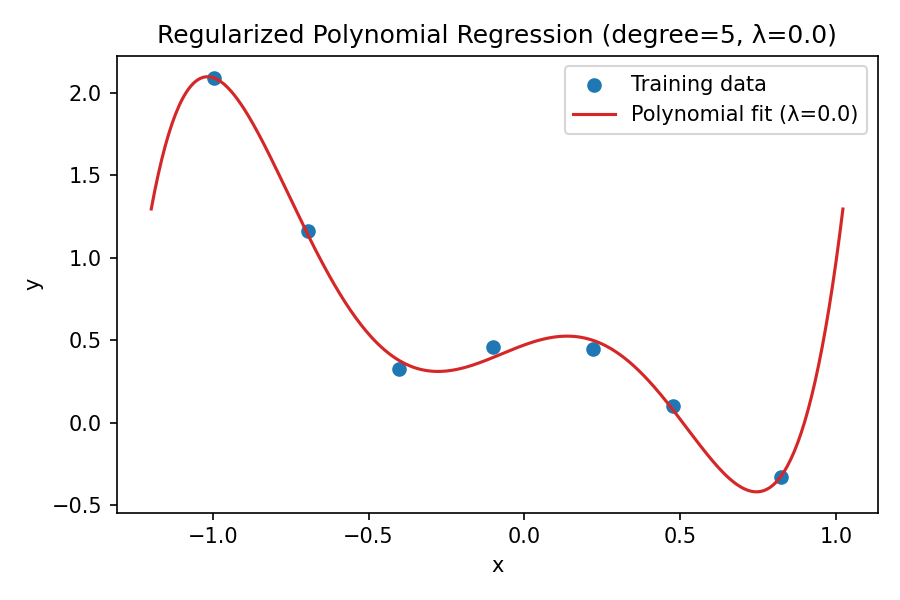
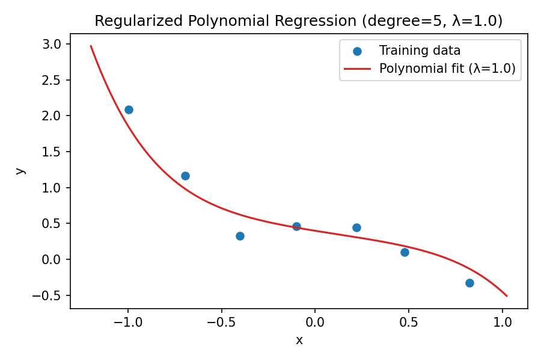
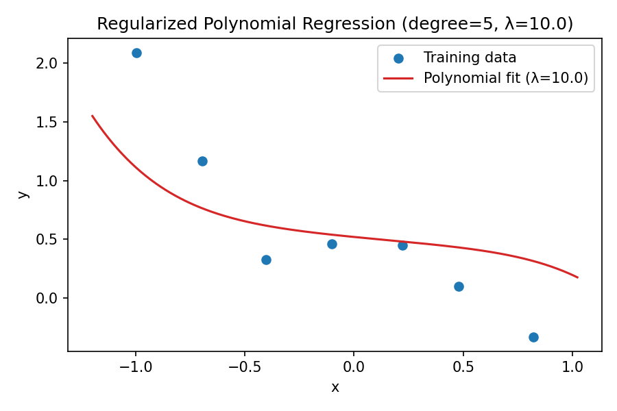
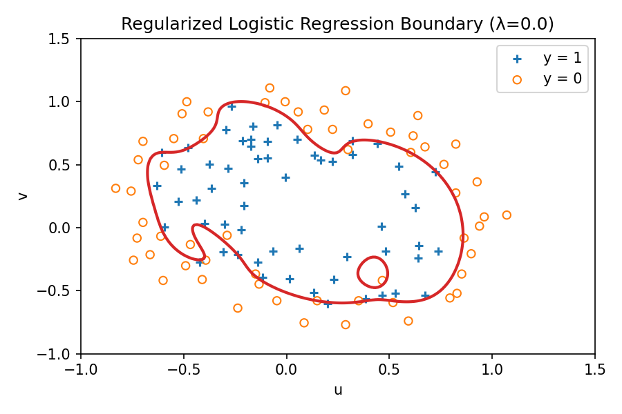
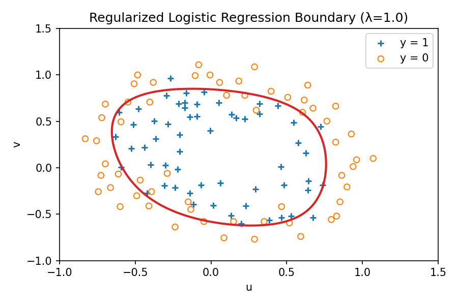
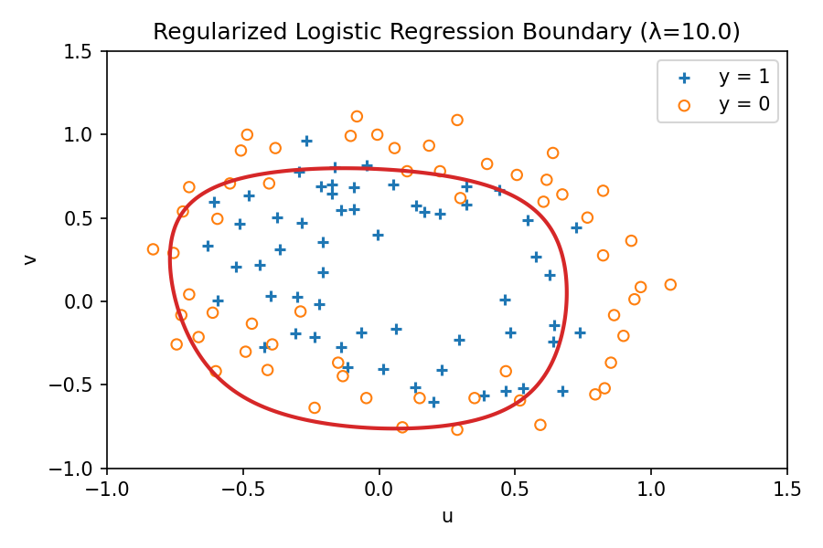

# 实验5：正则化

| 姓名 | 学号 |
| ---- | ---- |
|      |      |

## 实验简介
本实验基于 *Experiment 5: Regularization*，分别实现了带正则化的线性回归与逻辑回归模型。实验目标包括完成数学推导、给出 Python 实现流程、比较不同正则化强度下的模型表现，并可视化结果。

## 数据说明
- `data/ex5Linx.dat` 与 `data/ex5Liny.dat`：单变量回归样本，共 7 组点。
- `data/ex5Logx.dat` 与 `data/ex5Logy.dat`：二维输入的二分类数据集，标签为 0/1。
- 逻辑回归部分需要将原始 $(u, v)$ 特征映射到 6 阶多项式特征，共 28 维。

## 正则化线性回归
### 数学推导
令输入样本为 $x \in \mathbb{R}$，扩展至 5 阶多项式特征：
$$
h_\theta(x) = \theta_0 + \theta_1 x + \theta_2 x^2 + \theta_3 x^3 + \theta_4 x^4 + \theta_5 x^5
$$
采用 $L_2$ 正则化的均方误差损失：
$$
J(\theta) = \frac{1}{2m} \left[ \sum_{i=1}^{m} \left(h_\theta\!\left(x^{(i)}\right) - y^{(i)}\right)^2 + \lambda \sum_{j=1}^{n} \theta_j^2 \right]
$$
其中 $m$ 为样本数，$n=5$ 表示不含偏置项的特征数。最优参数可由正则化法方程直接获得：
$$
\theta = \left(X^\top X + \lambda \begin{bmatrix}0 & 0 \\ 0 & I_n \end{bmatrix}\right)^{-1} X^\top y
$$

### Python 实现要点
- 使用 `numpy` 生成多项式特征矩阵 $X = [\mathbf{1}, x, x^2, \dots, x^5]$。
- 构造对角矩阵实现对偏置项以外参数的 $L_2$ 正则化。
- 通过 `numpy.linalg.solve` 求解正则化法方程，不可逆时回退 `numpy.linalg.pinv`。
- `matplotlib` 用于绘制训练点与拟合曲线。

### 实验结果
| λ | 参数向量 θ（四舍五入到 4 位） | $ \|\theta\|_2 $ | 可视化 |
| - | - | - | - |
| 0 | [0.4725, 0.6814, -1.3801, -5.9777, 2.4417, 4.7371] | 8.1687 |  |
| 1 | [0.3976, -0.4207, 0.1296, -0.3975, 0.1753, -0.3394] | 0.8098 |  |
| 10 | [0.5205, -0.1825, 0.0606, -0.1482, 0.0743, -0.1280] | 0.5931 |  |

λ 越大，对高阶系数的抑制越明显，曲线趋向更平滑但拟合能力降低。

## 正则化逻辑回归
### 数学推导
采用 Sigmoid 假设函数：
$$
h_\theta(x) = \sigma(\theta^\top x) = \frac{1}{1 + e^{-\theta^\top x}}
$$
其正则化代价函数为：
$$
J(\theta) = -\frac{1}{m} \sum_{i=1}^{m} \Big[y^{(i)} \log h_\theta(x^{(i)}) + (1-y^{(i)}) \log\big(1-h_\theta(x^{(i)})\big)\Big] + \frac{\lambda}{2m} \sum_{j=1}^{n} \theta_j^2
$$
梯度和 Hessian 写为：
$$
\nabla_\theta J(\theta) = \frac{1}{m} X^\top \big(h_\theta(X) - y\big) + \frac{\lambda}{m} \begin{bmatrix}0 \\ \theta_{1:}\end{bmatrix}
$$
$$
H = \frac{1}{m} X^\top D X + \frac{\lambda}{m} \begin{bmatrix}0 & 0 \\ 0 & I_n\end{bmatrix}, \quad D = \operatorname{diag}\big(h_\theta(X) \odot (1 - h_\theta(X))\big)
$$
利用牛顿法迭代：
$$
\theta^{(t+1)} = \theta^{(t)} - H^{-1} \nabla_\theta J(\theta)
$$

### Python 实现要点
- 自行实现 `map_feature(u, v, degree=6)` 生成 28 维多项式特征。
- 逐次计算梯度、Hessian，使用 `numpy.linalg.solve` 更新参数；若矩阵奇异则使用伪逆。
- 迭代过程中记录成本下降情况，并判断参数更新量范数是否低于容差以提前停止。
- 通过在网格上评估 $z(u, v) = \theta^\top x$ 并绘制等高线 `z=0` 得到决策边界。

### 实验结果
| λ | 牛顿迭代次数 | $ \|\theta\|_2 $ | 最终成本 | 决策边界 |
| - | - | - | - | - |
| 0 | 16 | 7172.6946 | 0.199837 |  |
| 1 | 5 | 4.2400 | 0.524633 |  |
| 10 | 4 | 0.9384 | 0.647584 |  |

λ 较小时参数范数巨大，边界高度拟合训练集；λ 增大后范数显著减小，决策边界更平滑但误差上升。

## 正则化对模型的影响
- 线性回归中，λ=0 出现高阶系数爆炸并产生过拟合曲线；λ=1、10 降低参数范数并改进泛化，但过大时欠拟合。
- 逻辑回归中，未正则化时决策边界极度复杂，λ 提升后边界趋于光滑，说明正则项在抑制高阶多项式权重方面非常有效。
- 观测到 $ \|\theta\|_2 $ 与 λ 呈反比趋势，验证了正则化能通过限制参数模长控制模型复杂度。

## 运行方法
1. 激活虚拟环境（若已创建）：`source .venv/bin/activate`
2. 安装依赖：`pip install numpy matplotlib pdfminer.six`
3. 运行实验脚本：`python regularization.py`
4. 所有图片会保存在 `outputs/` 目录，可直接在 Typora 中预览本报告内的引用。
